  

<h1 align="center">Arpit Tyagi</h1>

  <strong>Build. Analyze. Optimize.</strong> 
  Turning data into decisions through analytics projects, BI dashboards, Python workflows, SQL analysis, and cloud-aware engineering.

  <a href="https://arpit-tyagi.vercel.app/">Portfolio</a>
  |
  <a href="https://www.linkedin.com/in/arpittyagi666666/">LinkedIn</a>
  |
  <a href="https://leetcode.com/u/arpit_tyagi_at/">LeetCode</a>
  |
  <a href="https://www.kaggle.com/arpittyagiat">Kaggle</a>

  

## Profile

  

I am a B.Tech 2027 student at SRM Institute of Science and Technology, based in Delhi, India. My profile is built around a simple operating line: build useful systems, analyze the data they produce, and optimize decisions from the evidence.

My strongest direction is the analytics engineering path: structured datasets, SQL analysis, Python notebooks, BI dashboards, and clear recommendations.

**Current focus**

- **Data analytics:** churn analysis, marketplace analytics, KPI design, dashboard storytelling.
- **Python and SQL:** data cleaning, exploratory analysis, reusable queries, reproducible notebooks.
- **Business intelligence:** Power BI reporting, stakeholder metrics, insight summaries.
- **Cloud fundamentals:** AWS basics, deployment awareness, data workflow fundamentals.
- **Problem solving:** DSA practice through LeetCode and structured implementation habits.

## Core Stack

  
  
  
  
  
  
  
  
  
  

## Selected Work

### [Bank Customer Churn Analysis](https://github.com/arpittyagi-at/bank-customer-churn-analysis)

Customer churn analytics case study for a banking product. The project is positioned around retention risk, customer segmentation, churn indicators, and dashboard-ready business recommendations.

`Python` `Pandas` `NumPy` `SQL` `Power BI`

### [Ecommerce Marketplace Analytics](https://github.com/arpittyagi-at/ecommerce-marketplace-analytics)

Marketplace analysis focused on orders, revenue, product categories, fulfillment patterns, and customer behavior. The goal is to turn transactional data into operating metrics a business team can use.

`Python` `SQL` `Pandas` `Power BI`

### [Arpit Tyagi Portfolio](https://github.com/arpittyagi-at/arpit-tyagi-portfolio)

Personal portfolio site for presenting projects, technical direction, and professional links through a clean responsive web experience.

`Frontend` `Vercel` `GitHub` `UI Engineering`

### [TaskManager ArpitTyagi](https://github.com/arpittyagi-at/TaskManager-ArpitTyagi)

Task management application demonstrating CRUD workflows, task state, clean interface states, and practical frontend structure.

`JavaScript` `Web App` `CRUD` `Responsive UI`

### [Mini E-Commerce Website](https://github.com/arpittyagi-at/Mini_E-Commerce_Website-ArpitTyagi)

Compact storefront project with product cards, cart-oriented interactions, and responsive ecommerce layout fundamentals.

`HTML` `CSS` `JavaScript` `Frontend`

## GitHub Activity

  

  

## Signals

- **Analytics direction:** banking churn and marketplace analytics repositories are the first projects shown.
- **Recruiter readability:** project descriptions lead with business context before tools.
- **Engineering discipline:** repository templates include architecture, setup, results, and improvement paths.
- **Learning trajectory:** AWS fundamentals and DSA practice support the analytics engineering direction.
- **Personal brand:** Build. Analyze. Optimize. is the through-line across projects, README copy, and visual assets.

## Connect

- [Portfolio](https://arpit-tyagi.vercel.app/)
- [LinkedIn](https://www.linkedin.com/in/arpittyagi666666/)
- [LeetCode](https://leetcode.com/u/arpit_tyagi_at/)
- [Kaggle](https://www.kaggle.com/arpittyagiat)

  

