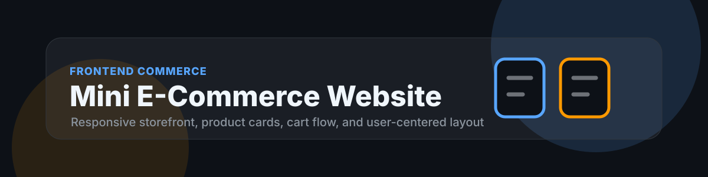

<p align="center">
  
</p>

# Mini E-Commerce Website

<p>
  
  
  
  
</p>

## Overview

Mini E-Commerce Website is a compact storefront project focused on product presentation, responsive layout, cart-oriented user flow, and clean frontend structure.

## Business Problem

Small product catalogs need a simple storefront that communicates product value, supports browsing, and makes purchase intent easy to express. Even a small ecommerce interface needs clear product cards, navigation, responsive behavior, and cart feedback.

## Objectives

| Objective | Outcome |
| --- | --- |
| Build a storefront UI | Present products through clean cards and visual hierarchy. |
| Support cart interactions | Add, remove, and update product selections. |
| Improve responsiveness | Keep browsing usable across desktop and mobile. |
| Practice frontend structure | Organize assets, styles, and scripts for maintainability. |

## Dataset

The project uses a product catalog model with product id, name, category, price, image, rating, availability, and description. Product data can be stored in a local JSON file or simple JavaScript data module.

## Architecture

```text
Product Catalog
  -> Product Grid
  -> Cart State
  -> Checkout Summary
  -> Responsive UI
  -> User Interaction Feedback
```

## Folder Structure

```text
.
|-- assets/
|   |-- banner.svg
|   |-- images/
|   `-- icons/
|-- css/
|   `-- styles.css
|-- js/
|   |-- products.js
|   `-- app.js
|-- screenshots/
|-- index.html
|-- README.md
`-- LICENSE
```

## Tech Stack

| Layer | Tools |
| --- | --- |
| Structure | HTML |
| Styling | CSS, responsive layout |
| Interaction | JavaScript |
| Workflow | Git, GitHub |

## Installation

```bash
git clone https://github.com/arpittyagi-at/Mini_E-Commerce_Website-ArpitTyagi.git
cd Mini_E-Commerce_Website-ArpitTyagi
start index.html
```

## Results

The completed site includes a responsive product grid, product details, cart actions, price summary, visual feedback, and a polished storefront experience appropriate for a frontend portfolio project.

## Screenshots

| View | File |
| --- | --- |
| Storefront | `screenshots/storefront.png` |
| Cart state | `screenshots/cart.png` |
| Mobile view | `screenshots/mobile.png` |

## Next Improvements

| Improvement | Value |
| --- | --- |
| Add product search and filters | Improve browsing for larger catalogs. |
| Add checkout validation | Make the purchase flow more realistic. |
| Add local storage cart persistence | Preserve cart state across sessions. |
| Add analytics events | Track product interest and user behavior. |

## License

This project is released under the MIT License.
