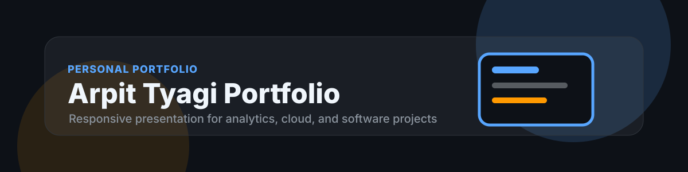

<p align="center">
  
</p>

# Arpit Tyagi Portfolio

<p>
  
  
  
  
</p>

## Overview

Arpit Tyagi Portfolio is a personal website designed to present projects, technical direction, and professional links with a clean, responsive interface. The site is positioned around data analytics, software projects, business intelligence, and cloud learning.

## Business Problem

Recruiters and collaborators need a fast way to understand technical focus, project quality, and professional credibility. The portfolio reduces friction by making project context, links, skills, and contact paths clear within seconds.

## Objectives

| Objective | Outcome |
| --- | --- |
| Present a focused profile | Highlight analytics, Python, SQL, BI, and cloud direction. |
| Showcase selected projects | Drive attention to the strongest public repositories. |
| Improve credibility | Use polished visuals, clear copy, and responsive structure. |
| Support discovery | Provide direct links to GitHub, LinkedIn, LeetCode, Kaggle, and contact. |

## Dataset

This is a portfolio website and does not depend on an analytical dataset. The content model includes profile metadata, project cards, skill groups, external links, and deployment configuration.

## Architecture

```text
Portfolio Content
  -> Component Sections
  -> Responsive Layout
  -> Static Build
  -> Vercel Deployment
  -> Public Portfolio URL
```

## Folder Structure

```text
.
|-- public/
|   `-- assets/
|-- src/
|   |-- components/
|   |-- data/
|   |-- pages/
|   `-- styles/
|-- assets/
|   `-- banner.svg
|-- README.md
|-- package.json
`-- vercel.json
```

## Tech Stack

| Layer | Tools |
| --- | --- |
| Interface | HTML, CSS, JavaScript or React |
| Deployment | Vercel |
| Version control | Git, GitHub |
| Design | Responsive UI, accessible content hierarchy |

## Installation

```bash
git clone https://github.com/arpittyagi-at/arpit-tyagi-portfolio.git
cd arpit-tyagi-portfolio
npm install
npm run dev
```

## Results

The portfolio provides a fast, polished first impression, direct project navigation, responsive layouts across desktop and mobile, and clear positioning as an early-career software and data analytics professional.

## Screenshots

| View | File |
| --- | --- |
| Home page | `public/screenshots/home.png` |
| Projects section | `public/screenshots/projects.png` |
| Mobile view | `public/screenshots/mobile.png` |

## Next Improvements

| Improvement | Value |
| --- | --- |
| Add project case-study pages | Give recruiters deeper context. |
| Add analytics dashboard preview | Align the site with data analytics positioning. |
| Add accessibility audit | Improve usability and professional quality. |
| Add performance checks | Keep loading fast on portfolio visits. |

## License

This project is released under the MIT License.
