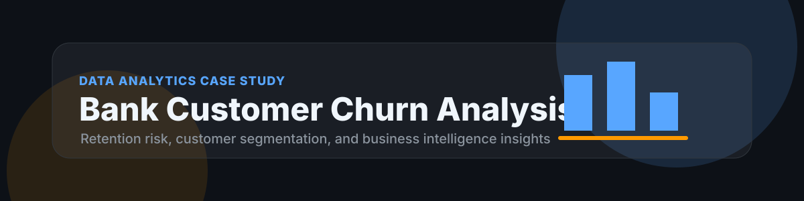

<p align="center">
  
</p>

# Bank Customer Churn Analysis

<p>
  
  
  
  
</p>

## Overview

Bank Customer Churn Analysis is a data analytics case study focused on identifying customers most likely to leave a banking product. The project translates account, demographic, and engagement signals into retention insights that can support targeted customer success and marketing actions.

## Business Problem

Customer acquisition is expensive, and churn directly reduces revenue, lifetime value, and product confidence. A bank needs a practical way to understand which customer groups are leaving, why they may be leaving, and which operational indicators deserve attention before churn happens.

## Objectives

| Objective | Outcome |
| --- | --- |
| Profile churned and retained customers | Compare customer segments across age, tenure, balance, products, and geography. |
| Identify churn drivers | Surface variables that show meaningful separation between churned and active customers. |
| Build decision-ready visuals | Create charts and BI views that business stakeholders can use quickly. |
| Document an analytics workflow | Keep the project reproducible from data loading to final insights. |

## Dataset

The project is designed for a structured banking churn dataset with customer demographics, account behavior, product usage, and churn status. Recommended fields include customer id, geography, gender, age, tenure, balance, number of products, credit card status, active member status, estimated salary, and churn label.

## Architecture

```text
Raw Dataset
  -> Data Cleaning
  -> Exploratory Data Analysis
  -> Churn Segmentation
  -> KPI Modeling
  -> Power BI Dashboard
  -> Business Recommendations
```

## Folder Structure

```text
.
|-- data/
|   |-- raw/
|   `-- processed/
|-- notebooks/
|   `-- churn_analysis.ipynb
|-- reports/
|   |-- figures/
|   `-- dashboard.pbix
|-- src/
|   |-- clean_data.py
|   `-- metrics.py
|-- assets/
|   `-- banner.svg
|-- README.md
`-- requirements.txt
```

## Tech Stack

| Layer | Tools |
| --- | --- |
| Analysis | Python, Pandas, NumPy |
| Querying | SQL, MySQL |
| Visualization | Matplotlib, Seaborn, Power BI |
| Workflow | Jupyter Notebook, Git, GitHub |

## Installation

```bash
git clone https://github.com/arpittyagi-at/bank-customer-churn-analysis.git
cd bank-customer-churn-analysis
python -m venv .venv
.venv\Scripts\activate
pip install -r requirements.txt
jupyter notebook
```

## Results

The completed analysis produces a clean churn summary, customer segment comparisons, retention-risk indicators, and dashboard views for business stakeholders. Final recommendations connect each insight to a practical retention action such as targeted outreach, product bundling, customer engagement monitoring, or service improvement.

## Screenshots

Add final visuals here when the notebook and dashboard artifacts are exported:

| View | File |
| --- | --- |
| Churn KPI dashboard | `reports/figures/churn_dashboard.png` |
| Segment comparison | `reports/figures/customer_segments.png` |
| Driver analysis | `reports/figures/churn_drivers.png` |

## Next Improvements

| Improvement | Business Value |
| --- | --- |
| Add a predictive churn model | Prioritize customers before they leave. |
| Add cohort analysis | Understand churn across tenure and onboarding periods. |
| Add Power BI drill-through pages | Let stakeholders inspect customer groups in detail. |
| Automate data refresh | Keep dashboards current with less manual work. |

## License

This project is released under the MIT License.
